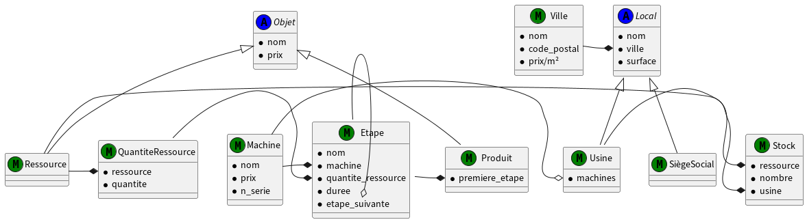

# Projet Crayon
<p align="center">
  
</p>

Le **Projet Crayon** a été développé dans le cadre du module de **Conception de Systèmes Orientés Objet à temps réel** du Master 2 ISTR à l'Université Paul Sabatier III. C'est une application Django dédiée à la gestion et à la simulation du processus de fabrications de crayons. On modélise des parties clés telles que les machines, ressources et l'usine tout en permettant leur gestion via l'interface d'administration Django. L'ensemble de la conception du système était basé sur le diagramme de classes UML, comme le montre la figure ci-dessous.


## Environnement virtuel
Creer un environnement virtuel afin de ne pas toucher à vos propres modlues deja intallés. Pour cela, il faut suivre les etapes suivantes:
```bash
python3 -m venv .venv
echo .venv >> .gitignore
source .venv/bin/activate
```
## Dependencies
Dans le fichier "requirements.txt" vous trouverz l'ensemble des dependances necessaires pour ce projet.
Afin d'installer l'ensemble des dependances, il suffit d'utiliser la commande suivante:
```bash
pip install -r /path/to/requirements.txt
```
## Installation
1- cloner le repertoire
```bash
git clone https://github.com/github_username/repo_name.git
```
2- Changer le "git remote url" pour eviter les "push" vers le projet de base
```bash
git remote set-url origin github_username/repo_name
git remote -v # confirm the changes
```
## Fonctionnalité 1 -- High level
Création de l’interface d’administration
```bash
./manage.py makemigrations
./manage.py migrate
./manage.py createsuperuser
./manage.py runserver
```


### Utilisation de l’interface d’administration
Pour utiliser l'interface, il faut se rendre au lien suivant:
http://localhost:8000/admin

A travers ce lien, on peut ajouter, modifier et supprimer des données pour l'ensemble des modèles.

### Accès au données des objets
Se rendre au lien suivant:
http://localhost:8000/Object_name/Object_ID/

Dans le fichier urls.py on relie les routtes aux vues associées définies dans le fichier views.py. Dans le fichier views.py, les classes de type DetailView sont utilisées pour récuperer les données d'un objet depuis la base de données et les renvoyer sous forme de reponse JSON ou JSON EXTENDED. 

A partir de ce lien, on peut visulaiser les données de nos objets tels que machine ou produit sous forme de JSON ou données brutes. 

## Fonctionnalité 2 -- low level
Compilation du projet
```bash
cmake -B build -S .
cmake --build build
./build/low_level
echo build >> .gitignore
```
Les données sont récupérées via des requêtes HTTP. 

### Exemple de données:

1- Ville
```bash
Ville: TLS-01
Code Postal: 31400
Prix au mètre carré: 3000
```

2- Produit
```bash
Produit: Crayon
Prix: 3
Première étape ID: 3
Détails de la première étape:
Etape: Couper bois
Durée: 2
Quantité nécessaire: 4
Détails de la Machine:
Machine: Scie
Prix: 5000
Numéro de série: 123456789
Etape suivante ID: 4
Détails de l'étape suivante:
	 Etape: Rainurage
Durée: 2
Quantité nécessaire: null
Détails de la Machine:
Machine: Rainureuse
Prix: 8000
Numéro de série: 2345678910
Etape suivante ID: 5
Détails de l'étape suivante:
	 Etape: Insertion Mine
Durée: 2
Quantité nécessaire: 5
Détails de la Machine:
Machine: Presse d’insertion
Prix: 15000
Numéro de série: 34567891011
Etape suivante ID: 6
Détails de l'étape suivante:
	 Etape: Moulage et découpage
Durée: 2
Quantité nécessaire: null
Détails de la Machine:
Machine: Moulureuse -découpeuse
Prix: 20000
Numéro de série: 456789101112
Etape suivante ID: 7
Détails de l'étape suivante:
	 Etape: Peinture et séchage
Durée: 5
Quantité nécessaire: 6
Détails de la Machine:
Machine: peinture-séchage
Prix: 20000
Numéro de série: 5678910111213
Etape suivante ID: 9
Détails de l'étape suivante:
	 Etape: Affûtage
Durée: 2
Quantité nécessaire: null
Détails de la Machine:
Machine: Affûteuse
Prix: 10000
Numéro de série: 67891011121314
Etape suivante ID: 8
Détails de l'étape suivante:
	 Etape: Emballage
Durée: 3
Quantité nécessaire: null
Détails de la Machine:
Machine: Machine d’emballage
Prix: 12000
Numéro de série: 789101112131415
Etape suivante ID: null
Fin du produit !.
```

3- Siège social
```bash
Siège Social: Renay pencils
Surface: 400
Ville ID: 1
Détails de la Ville:
Ville: TLS-01
Code Postal: 31400
Prix au mètre carré: 3000
```

## Fonctionnalité 3 -- Test unitaire
Pour executer les tests unitaires:
```bash
./manage.py test
```
Pour acceder aux tests unitaire:
```bash
cd high_level
open tests.py
```
### Exemples de Tests:
1- Test achat de ressources nécessaires

Ce test verifie si les ressources manquantes sont correctement identifiées et achetées pour atteindre l'objectif de production:
``` bash
Nombre de crayons à fabriquer : 10
Stock avant achat :
Ressource : Bois, Quantité : 10
Ressource : Mine, Quantité : 2
Ressources manquantes :
Ressource : Mine, Quantité à acheter : 28
Ressource : Bois, Quantité à acheter : 40
Stock après achat :
Ressource : Bois, Quantité : 50
Ressource : Mine, Quantité : 30
```

2- Test création de machine

Ce test s'assure que la creation d'une machine est réalisée avec les bons attributs:
``` bash
Nom de la machine : scie
Prix de la machine : 1000
Numéro de série de la machine : 16832
```

3- Test création de l'usine

Ce test calcule le coût total de creation d'une usine:
```bash
Cout usine 1 :  100000
Cout machine :  3000
Cout stock :  10750
Cout total de l'usine :  113750
```

## Licence

Ce projet est sous licence [Eclipse Public License - v 2.0](LICENSE).

Vous pouvez utiliser, modifier et distribuer le programme conformément aux termes de cette licence. Consultez le fichier `LICENSE` dans le dépôt pour plus de détails.


## Contact
- **Mail**: [rayen.hamadi@univ-tlse3.fr](mailto:rayen.hamadi@univ-tlse3.fr)
- **Mail**: [rayenhamadi48@gmail.com](mailto:rayenhamadi48@gmail.com)
  
## Encadrement
Guilhem Saurel 

Equipe IDEA au LAAS CNRS 

**Mail**: [guilhem.saurel@laas.fr](mailto:guilhem.saurel@laas.fr)
